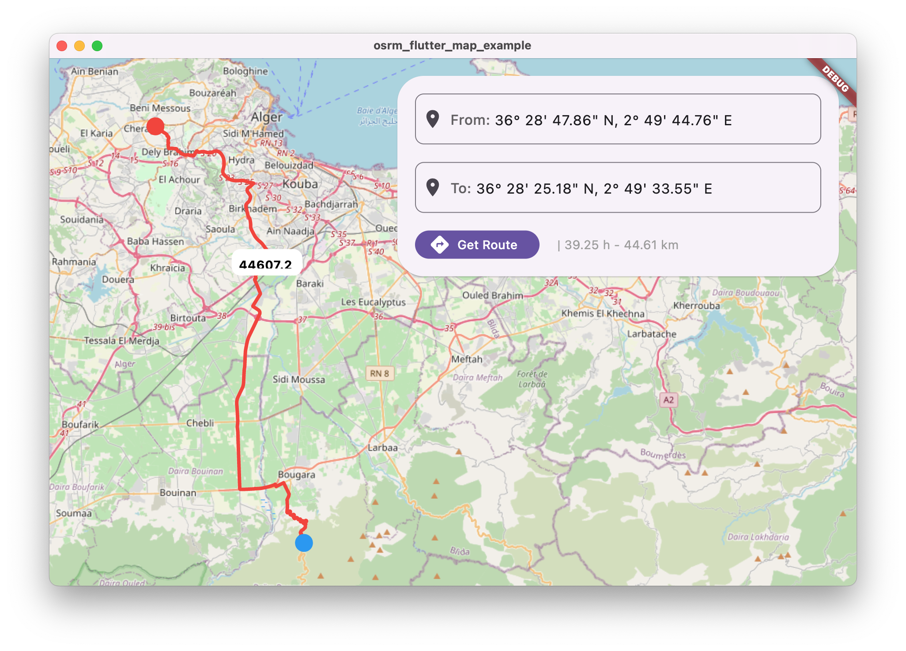

/// /Users/Shared/dev/opensource/dart/kflutter/osrm/docs/screenshot_2023-08-02.png
<center><a href="https://www.buymeacoffee.com/mohamadlounnas"></a></center>

# OSRM Dart Client
[](https://pub.dartlang.org/packages/osrm)


This package is the OSRM client for Dart and Flutter. It provides a simple and easy-to-use interface for communicating with an OSRM server and retrieving routing and other information.

and of course, because it's written in Dart, it can be used in any platform that supports Dart.

To use this package, simply add it to your `pubspec.yaml` file:
dependencies:
    osrm:
## Usage
To use the OSRM client, first create an instance of the `OSRM` class:
### Simple use
#### nearest service
```dart
NearestResponse response = await osrm.nearest(
  NearestOptions(
    coordinate: (-0.1234, 51.1234),
    number: 3
  ),
);
```
#### routing (directions in GoogleMap) service
```dart
final route = await osrm.route(
  RouteRequest(
    coordinates: [
      (-0.1234, 51.1234), // Point A
      (-0.1234, 51.1234), // Point B
      (-0.1234, 51.1234), // Point C
    ],
    alternatives: OsrmAlternative.true_,
    steps: true,
    annotations: OsrmAnnotation.true_,
    overview: OsrmOverview.full,
    continueStraight: OsrmContinueStraight.true_,
    format: OsrmFormat.json,
    waypoints: [
      /// Waypoints are listed in order of visit
      OsrmWaypoint(
        distance: 0.0,
        location: (-0.1234, 51.1234),
      ),
    ],
  ),
);
```

this package under development.

## TODO
- [x] add **Nearest** service
- [x] add **Nearest** service tests
- [x] add **Route** service
- [x] add **Route** service tests
- [x] add dart example
- [x] add flutter example
- [ ] add **Match** service
- [ ] add **Table** service
- [ ] add **trip** service
- [ ] add **Tile** service
- [ ] integrate with flutter ()

## Support/Sponcer/More?
any contrubutions/support are welcome :)

Contact me: <mohamadlounnas@gmail.com>

Github: [@mohamadlounnas](github.com/mohamadlounnas)

Linkedin: [@mohamadlounnas](https://www.linkedin.com/in/mohamadlounnas/)


